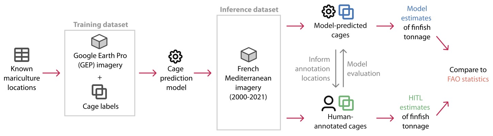

# Locating and measuring marine aquaculture production with remote sensing: a computer vision approach in the French Mediterranean
## Sebastian Quaade, Andrea Vallebueno, Olivia D. N. Alcabes, Kit T. Rodolfa, Daniel E. Ho

This is the code repository for "Locating and measuring marine aquaculture production 
with remote sensing: a computer vision approach in the French Mediterranean."


Building on a manual survey of aquaculture production from remote sensing imagery, we train a 
computer vision model to identify  marine aquaculture cages from remote sensing imagery, 
and generate a spatially explicit dataset of finfish production locations in the French 
Mediterranean from 2000-2021. 

To train our model, we use the mariculture locations in the Mediterranean identified by 
[Trujillo et al. (2012)](https://journals.plos.org/plosone/article?id=10.1371/journal.pone.0030546), 
which can be found in the following file: `data/aquaculture_med_dedupe.csv`.




Citation: (TBD)
```
@article{citation_key,
  author = {Author Name},
  title = {Article Title},
  journal = {Journal Name},
  year = {Year},
  volume = {Volume},
  number = {Number},
  pages = {Pages},
  doi = {DOI}
}
```

## Table of contents
1. Training the YOLOv5 model
2. Running inference on the French Mediterranean and processing the detections
3. Generating Manuscript Results
4. Dataset release


### Training the YOLOv5 model
We collected imagery from [Google Earth Pro](https://earth.google.com) to train the object detection model to generate bounding
boxes around marine finfish cages. Due to the licensing terms for this imagery, we do not publish this training
data, but rather make it available to academic researchers upon request. This dataset contains 896 remote
sensing images from Google Earth Pro, as well as bounding box annotations for 1,775 circular finfish cages, 
689 square finfish cages and 7 other cages. Please reach out to `deho@stanford.edu` to make a request. 

The following command can be used to train a YOLOv5 model on our GEP data.
More information about these commands can be found in the [YOLOv5 documentation](https://docs.ultralytics.com/yolov5/).

```
python3 yolov5/train.py --img 640 --batch 16 --epochs 50 --data model/multilabel_farms.yaml --weights yolov5m.pt --project multilabel_farms
```

### Running inference on the French Mediterranean and processing the detections
We ran inference on aerial imagery of the French Mediterranean, sourced from the 
[BD Ortho](https://geoservices.ign.fr/bdortho) series 
published by Institut national de l'information géographique et forestière (IGN).
The YOLOV5 weights we used to run inference on the French Mediterranean data can be
found in our repository at this location: `output/model_weights/multilabel_farms_exp2.pt`.

1. Load the French data using the following scripts. 
Note: the French data tif files occupy 2.83 TB and the jpeg files occupy 62.8 GB. Our implementation assumes
the imagery is being stored on a bucket in Google Cloud Storage (GCS). Replace the `gcs_bucket` and `gcs_path`
parameters in the command below with your own GCS specifications, and the `initial_tif_dir`, `tiled_tif_dir`
and `jpeg_dir` with the paths to where the tif files, tiled tif files and jpeg files will be saved.

```
python3 load_data/load_shapefiles.py 
python3 load_data/download_french_data.py --gcs_bucket image-hub --gcs_path coastal_french_data/tifs
python3 load_data/tile_tifs.py --initial_tif_dir data/initial_tifs --tiled_tif_dir data/tiled_tifs --jpeg_dir data/jpegs
```

2. Run inference on the data using the provided weights. In the below command, replace the `source` parameter
with the location where you have stored the jpeg files. 
```
python3 yolov5/detect.py --weights output/model_weights/multilabel_farms_exp2.pt --source data/jpegs --nosave --save-txt --save-conf &
```

3. Post-process the YOLOv5 inferences on the French data and estimate the surface area of detected
cages (in square meters). These scripts result in a geojson file that has all geocoded detections. Replace 
`detection_txt` with the location where you have stored the detection .txt files produced
by running inference using the YOLOv5 model.

_Note:_ The Maritime Boundaries and Exclusive Economic Zones shapefile requires the user to download
the data manually. Please use [this link](https://www.marineregions.org/gazetteer.php?p=details&id=5677) and
download in shapefile format. Then, please store the unzipped
file in the following directory: `data/shapefiles/raw` such that the final file path is 
`data/shapefiles/raw/eez/eez.shp`.

```
python3 src/load_data/create_land_filter.py
python3 src/process_yolo/geocode_results.py --gcs_bucket image-hub --gcs_im_path coastal_french_data/jpegs --detection_txt data/french_inference_labels/labels
python3 src/process_yolo/calc_net_areas.py
```


### Generating Manuscript Results
This section can be run independently to produce the findings and figures presented in the manuscript, without
the need to load the French imagery data and run inference using our model weights. It uses the human-annotated
cage labels (`output/humanlabels.geojson`), as well as a geojson of the model-predicted cages (`output/detections.geojson`).

Before running the following scripts, unzip the `image_boxes_years.zip` file that is located in the
`data` directory and store the three .geojson files such that their final path is `data/image_boxes_years.geojson`, 
`data/image_boxes_years_dedup.geojson` and `data/image_boxes_years_rmblank.geojson`.

* Load the Bathymetry data
```
python3 src/load_data/bathymetry_data.py
```
* Generate the Model Prediction and Human-Annotated Facility object instances. 
```
python3 src/Results/generate_facilities.py --conf_thresh 0.785 --min_cage_threshold 1 --distance_threshold 50 --min_cluster_size 5 --default_cage_depth 4.84 --bathymetry_statistic "bathy_min"
```
* Create French land shapefile

_Note:_ The Maritime Boundaries and Exclusive Economic Zones shapefile requires the user to download
the data manually. Please use [this link](https://www.marineregions.org/gazetteer.php?p=details&id=5677) and
download in shapefile format. Then, please store the unzipped
file in the following directory: `data/shapefiles/raw` such that the final file path is 
`data/shapefiles/raw/eez/eez.shp`.
```
python3 src/load_data/create_land_filter.py
```

Once you have run the three scripts above, you can reproduce the findings presented in the manuscript
using the following scripts.
1. Generate the model performance stats and plots (Fig. 3). Note that the `get_kfold_cluster_performance.py` script, which runs the hyperparameter grid search described in the paper, is configured by the `get_kfold_cluster_performance_cfg.py` file. We enter the best hyperparameters identified during our run as fixed constants in the file that can be updated if you change the search parameters.
```
python3 src/get_kfold_cluster_performance.py
python3 src/Results/ModelPerformance.py
```
2. Generate the facility map and comparison to Trujillo facilities (Fig. 4)
```
python3 src/Results/FacilitiesMaps.py
```
3. Compute the tonnage estimates and tonnage near Trujillo facilities (Fig. 6)
```
python3 src/Results/tonnage_estimates.py --conf_thresh 0.785 --min_cage_threshold 1 --depth_dist_mixture_param 0.5 
```
4. Cage population estimation exercise
```
Rscript src/Results/upper_bound_calculation.R
```

### Dataset release
To enable other researchers seeking to apply our method, we make available the following object 
detection datasets (in YOLO format). As discussed above, we only make the GEP portion of the dataset
available to academic researchers upon request due to the licensing terms of the imagery. 
The public version of the dataset can be found on [HuggingFace](https://huggingface.co/datasets/reglab/aquaculture_detection).

* French aerial imagery: 286 aerial images (from IGN's [BD Ortho](https://geoservices.ign.fr/bdortho) series) containing 4,142 human-annotated finfish cage bounding boxes
* GEP imagery: 896 images containing 2,464 human-annotated finfish cage bounding boxes


### References

Google, Google Earth Pro, versions 7.3.4.8573-7.3.6.9326, Google Earth (2023);
https://earth.google.com.

Institut national de l’information géographique et forestière, BD704
ORTHO, version 2.0, République Française Géoservices (2023);
https://geoservices.ign.fr/documentation/donnees/ortho/bdortho.

P. Trujillo, C. Piroddi, J. Jacquet, Fish Farms at Sea: The Ground Truth from Google Earth.672
PLos One 7, e30546 (2012).